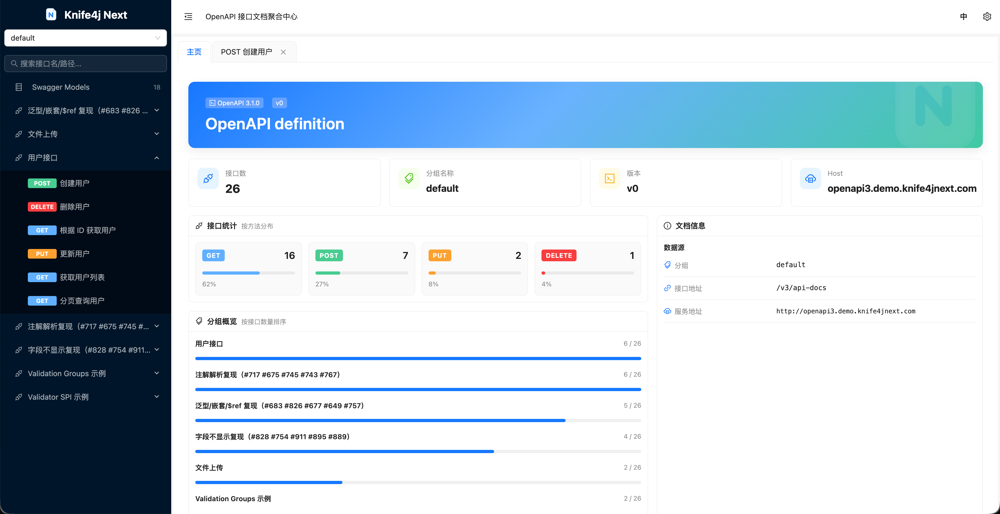
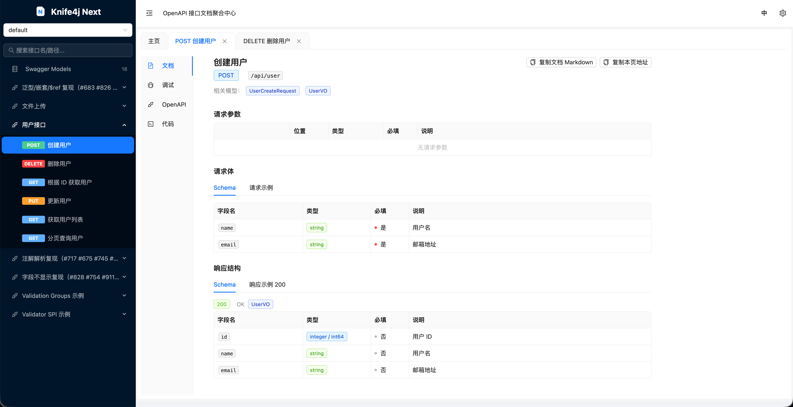
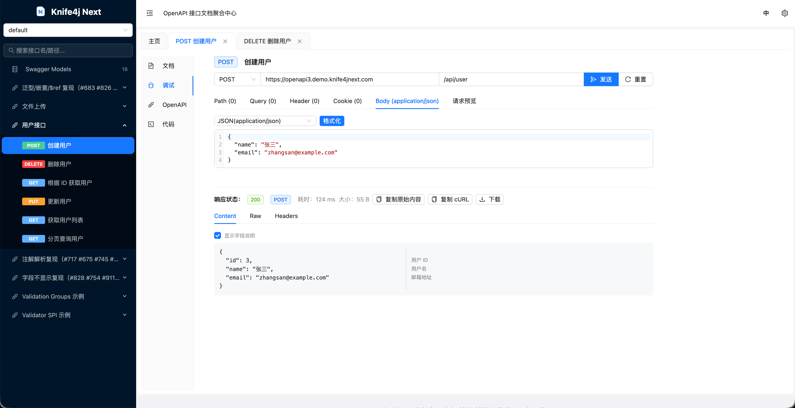

# knife4j-next

`knife4j-next` 是一个面向社区持续维护的 `knife4j` fork。它服务于仍依赖 `doc.html` 体验和相关 starter
模块的用户，目标是在保持兼容性的前提下，提供更稳定的维护节奏、发布流程和下一代前端演进路径。

## 项目定位

| 项目 | 说明 |
|---|---|
| 仓库来源 | fork 自 `xiaoymin/knife4j` |
| 当前定位 | 社区维护分支，不是 upstream 官方仓库 |
| Java 主坐标 | `com.baizhukui` |
| 当前稳定版本 | `5.0.16` |
| 默认访问入口 | `http://ip:port/doc.html` |
| 文档站 | [knife4jnext.com](https://knife4jnext.com) |

`doc.html` 仍然是默认访问入口，这一点保持与原项目兼容。

当前维护重点：

- 跟进 Spring Boot 2.7 / 3.x / 4.x 与 Spring Framework 5.3 / 6.x / 7.x 的兼容性
- 修复社区长期积压的回归与聚合场景问题
- 建立清晰、可重复的发布流程
- 为 React 方向的下一代前端做增量演进，而不是一次性推倒重来

## 快速开始

### 选择 Starter

版本统一使用当前稳定版本 `5.0.16`。

| 使用场景 | Maven `artifactId` |
|---|---|
| Spring Boot 2.x / Swagger 2 / OAS2 | `knife4j-openapi2-spring-boot-starter` |
| Spring Boot 2.x / OpenAPI 3 / Javax | `knife4j-openapi3-spring-boot-starter` |
| Spring Boot 3.x / Jakarta | `knife4j-openapi3-jakarta-spring-boot-starter` |
| Spring Boot 4.x / Jakarta | `knife4j-openapi3-boot4-spring-boot-starter` |
| Spring Cloud Gateway | `knife4j-gateway-spring-boot-starter` |
| Spring Cloud Gateway / Spring Boot 4.x | `knife4j-gateway-boot4-spring-boot-starter` |
| Spring Boot 4.x / 独立聚合 | `knife4j-aggregation-boot4-spring-boot-starter` |

### Maven 依赖

```xml
<dependency>
    <groupId>com.baizhukui</groupId>
    <artifactId>knife4j-openapi3-boot4-spring-boot-starter</artifactId>
    <version>5.0.16</version>
</dependency>
```

如果你的使用场景不是 Spring Boot 4.x，将 `artifactId` 替换为上表对应的 starter。

启动应用后访问：

```text
http://ip:port/doc.html
```

## 界面预览

### OpenAPI 文档概览



### 接口文档详情



### 在线调试



## 仓库结构

| 路径 | 说明 |
|---|---|
| `knife4j/` | Java 主工程（starter、UI webjar、聚合、Gateway、WebFlux、smoke 与 demo） |
| `front/` | 活跃前端：`core` + `ui-react`（OAS3 workspace）、`vue3`（OAS2 兼容） |
| `knife4x/` | Go/Rust 嵌入式控制台骨架（规划中，与 `front/ui-react` 共用 UI） |
| `docs/` | VitePress 文档站 |
| `tools/` | 验证与发布辅助脚本（原 `scripts/`） |
| `legacy/` | 冻结参考：`vue2`、`insight`、`sandbox`（不参与主线构建） |
| `static/` | README 配图等静态资源 |

## 维护策略

| 方向 | 源码 | 产物 / 使用方 | 策略 |
|---|---|---|---|
| Java 后端 | `knife4j/` | starter、UI webjar、聚合组件 | 优先做兼容性修复、回归修复和发布维护 |
| OAS3 主线 UI | `front/ui-react` | `knife4j-openapi3-ui` webjar；Knife4x embed | 承接新功能、UX 改进和调试器增强 |
| OAS3 解析核心 | `front/core` | React UI 内部依赖 | 服务于 OAS3 主线，不为 OAS2 扩展 |
| OAS2 兼容 UI | `front/vue3` | `knife4j-openapi2-ui` webjar | 只接收回归修复、安全补丁与显示层 bug |
| Knife4x | `knife4x/` | Go / Rust 宿主壳 | 骨架阶段；UI 不另开工程 |
| 历史代码 | `legacy/` | 无发布目标 | 仅参考，勿接常规功能任务 |
| 文档站 | `docs/` | [knife4jnext.com](https://knife4jnext.com) | 当前对外文档主入口 |

## 本地开发

### Java Demo

```bash
cd knife4j
mvn -pl knife4j-demo-openapi3 -am spring-boot:run
# 浏览器打开 http://localhost:8080/doc.html
```

```bash
cd knife4j
mvn -pl knife4j-demo-openapi2 -am spring-boot:run
# 浏览器打开 http://localhost:8081/doc.html
```

### 文档站

```bash
cd docs
bun install --frozen-lockfile
bun run dev
```

### React 前端

```bash
cd front
bun install --frozen-lockfile
bun run --filter knife4j-ui-react dev
```

### Vue3 前端

```bash
cd front/vue3
bun install --frozen-lockfile
bun run dev
```

## 验证命令

| 改动范围 | 推荐命令 |
|---|---|
| Java 主工程 | `./tools/test-java.sh` |
| React 前端 / `knife4j-core` | `./tools/test-front-core.sh` |
| Vue3 前端（OAS2 `doc.html`） | `./tools/test-vue3.sh` |
| 文档站 | `./tools/test-docs.sh` |
| 跨多个区域 | `./tools/test-all.sh`（java / front-core / vue3 / docs） |

`./tools/test-java.sh` 会进入 `knife4j/`，执行 `spotless:check`、带测试的 Maven `verify`，并检查 smoke 测试证据。不要用单独的
`mvn -B -ntp verify` 替代提交前验证。

## 文档与链接

- 文档站：[knife4jnext.com](https://knife4jnext.com)
- 仓库地址：[songxychn/knife4j-next](https://github.com/songxychn/knife4j-next)
- Issue 反馈：[GitHub Issues](https://github.com/songxychn/knife4j-next/issues)
- Release 记录：[GitHub Releases](https://github.com/songxychn/knife4j-next/releases)
- Java 发布说明：[knife4j/RELEASE.md](./knife4j/RELEASE.md)
- 迁移指南：[knife4j/MIGRATION.md](./knife4j/MIGRATION.md)
- 文档站源码：[docs](./docs)

涉及历史功能细节时，仍可参考 upstream 文档站 `https://doc.xiaominfo.com/`；该站点不由本仓库维护。

## Star History

<p align="center">
  <a href="https://www.star-history.com/songxychn/knife4j-next">
    <picture>
      <source media="(prefers-color-scheme: dark)" srcset="https://api.star-history.com/chart?repos=songxychn/knife4j-next&type=date&theme=dark&legend=top-left" />
      <source media="(prefers-color-scheme: light)" srcset="https://api.star-history.com/chart?repos=songxychn/knife4j-next&type=date&legend=top-left" />
      
    </picture>
  </a>
</p>

## 与 upstream 的关系

本仓库尊重并感谢原项目 `xiaoymin/knife4j` 的长期贡献。`knife4j-next` 的目标不是抹去 upstream，而是在其长时间未稳定发布的阶段，为现有用户提供一个更可预期的社区维护分支，并逐步补齐：

- 兼容性修复
- 迁移说明
- 文档与版本说明
- 更清晰的前端演进路线

## 迁移提醒

- 本仓库当前仍可能保留部分历史文档、图片、站点配置和旧链接，后续会逐步替换为 fork 自己的叙事与入口。
- 如果你正在从 upstream 迁移，短期内最重要的变化是 Maven `groupId` 已切换为 `com.baizhukui`；详见 [迁移指南](./knife4j/MIGRATION.md)。
